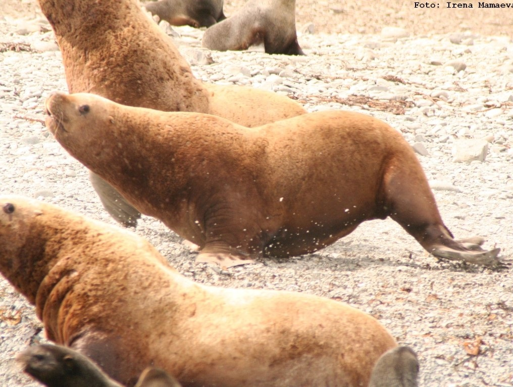
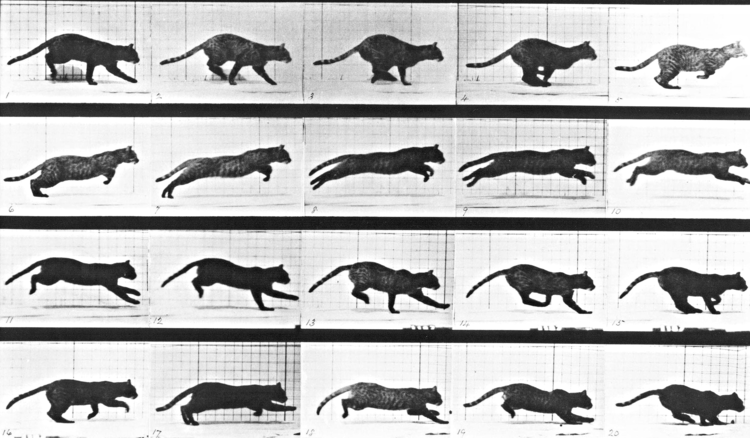

```{r setup, include=FALSE}
knitr::opts_chunk$set(echo = FALSE, message = FALSE, cache = TRUE, warning = FALSE, las = 1, dpi = 200)
#output: html_document
```

```{r colsFunction, echo = FALSE, eval = FALSE}
xaringan::inf_mr()
```


.pull-left[
## Dr. Elie Gurarie


]
.pull-right[

]

.small[
*Caribou | Wolves | Steller sea lions | Northern fur seal | Pacific salmon | Sea otters | Sea lamprey | Brown bear | White-tailed deer | Fisher | Coyote | Ladoga ringed seal | Panda bear | Roe deer | Manatee | Southern three-banded  armadillo | Polar bear | Antarctic ice seals | Dall sheep | Mexican fish-eating bats | Asiatic Cheetah | Persian Leopard | Kestrel | Bowhead whales | more ...*
]

---

## Course Goals
.pull-left[

### Develop skills in animal movement analysis

Roughly: 

- manipulation
- visualization & summarization
- models of movement
- behavioral structure / segmentation
- home ranges
- resource & step-selection
- **special topics of interest to students**

Everything in .blue.Large[**R**]

]

.pull-right-50[ 
]


---

## Structure

.pull-left-40[
### Most days:

- Short lecture + concepts

- Lab led by instructor

- In-class exercises

- HW assignments developing skills

]

--


.pull-right-60[

### Course materials

- **Book**: useful dynamic reference - here: 
  - **https://eligurarie.github.io/MovementEcologyBook/**

- **Blackboard**: 
  - announcements / assignments / possibly data / **discussion forum**

- *Potentially will require everyone setting up a GitHub repository*


]

---
class: inverse

# Final project!


.pull-left.large[

- Ideally, on **your data**

- Moves **your research forward**

- Approximate timeline: 

  - **Week 2:** Propose ideas.  Can be workshopped with me. 
  
  - **Week 3-14**: Make Progress
  
  - **Week 15:** Present

]


.pull-right[


]


