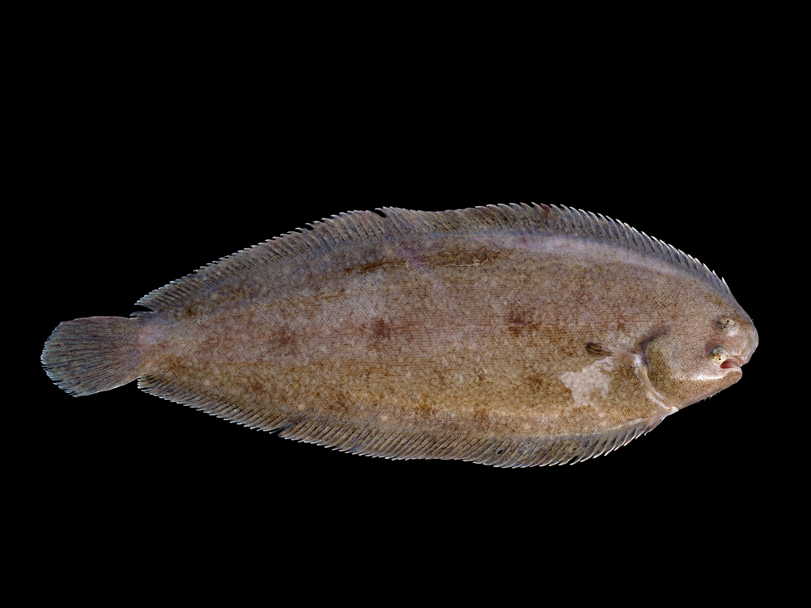

*the beautiful common sole*

## Goals

- Understand binomial/Bernoulli modeling for binary response data (presence/absence)
- Visualize binary response variables against continuous predictors effectively
- Implement logistic regression from first principles using maximum likelihood estimation
- Estimate parameters manually using `optim()` and compare with `glm()`
- Obtain confidence intervals via both the Hessian matrix and bootstrapping
- Perform model selection using likelihood ratio tests, AIC, and BIC

All of this lays the foundation for understanding **resource selection functions**, and is our first foray into *presence* as a function of *environmental covariates*. 

## The Data

To motivate this, here is a data-set of presence and absence of common sole (a kind of flat-fish, *Solea solea*) in the estuary of the [Tejo river](https://pt.wikipedia.org/wiki/Rio_Tejo) in Portugal. The response variable is binary (absence = 0, presence = 1), and there are various potential explanatory covariates, in this case continuous ones like salinity, temperature, depth, relative percentages of gravel/sand/mud.[^1] The data can be found at the file [Solea.csv](data/Solea.csv). 

[^1]:
I got this example from a quite excellent ecological statistics book: [*Mixed Effects Models and Extensions in Ecology with R* (2009). Zuur, Ieno, Walker, Saveliev and Smith. Springer](http://www.highstat.com/book2.htm)

```{r}
Solea <- read.csv("data/Solea.csv")
```

```{r}
head(Solea)
```


Let's just look for now at the presence of sole with respect to salinity.  Note that the explanatory variable is continuous, and the response variable is discrete, i.e. we are flipping a one-way ANOVA on its side.

Plotting a binary response is not that as easy as scatterplotting continuous covariates. Below is a slightly elaborate option:


```{r, fig.height=4, fig.width = 6, echo=-1}
par(bty="l", cex.lab=1.25, mar=c(5,5,2,2))
Y <- Solea$Solea_solea
X <- Solea$salinity
plot(X, jitter(Y, factor=0.1), col=rgb(0,0,0,.5), pch=19, ylim=c(-.2,1.2), xlab="Salinity", ylab="Presence", yaxt="n")
boxplot(X~Y, horizontal=TRUE, notch=TRUE, add=TRUE, at=c(-.1,1.1), width=c(.1,.1), col="grey", boxwex = 0.1, las=1)
```

There are many things going on here.  Note, we can generalize this code to make a handy function that plots these kinds of data: 

```{r}
plotBinary <- function (X, Y, ...) 
 {
     plot(X, jitter(Y, factor = 0.1), col = rgb(0, 0, 0, 0.5), 
         pch = 19, ylim = c(-0.2, 1.2), ...)
     boxplot(X ~ Y, horizontal = TRUE, notch = TRUE, add = TRUE, 
         at = c(-0.1, 1.1), width = c(0.1, 0.1), col = "grey", 
         boxwex = 0.1, yaxt = "n")
 }
```
	
Note, the all-important super-useful "..."

So, for example:

```{r, fig.height=10, echo = -1}
par(mfrow=c(3,1), bty="l", mar=c(4,4,1,1), cex.lab=1.5)
with(Solea, plotBinary(salinity, Solea_solea, xlab="salinity", ylab = "Presence", yaxt = "n"))
with(Solea, plotBinary(temp, Solea_solea, xlab="temperature",   ylab = "Presence", yaxt = "n"))
with(Solea, plotBinary(depth, Solea_solea, xlab="depth", ylab = "Presence", yaxt = "n"))
```

Lots of ecologically relevant relationships. 


## GLM background

We build by analogy to the standard linear models we've fitted so far:
$$ Y_i = \beta_0 + \beta_1 X_1 + \beta_2 X_2 + ... + \epsilon_i $$
where the $X$'s are covariates, the $\beta$'s are regression coefficients, and $\epsilon$ is a ${\cal N}(0,\sigma^2)$ random variable.

We can rewrite this equation, equivalently, as:
$$ Y_i = {\cal N}(\mu, \sigma^2) $$
$$ E(Y_i) = \mu = {\bf X}\beta $$

Where ${\bf X}\beta$ is a way of expressing the fact that the expected value of the response is a product of a matrix of covariates $\bf X$  and a vector of coefficients $\beta$ - (the matrix notation is just an efficient bookkeeping scheme - trust me).  Together, ${\bf X}\beta$ are called the *linear  predictor*.

In a GENERALIZED linear model, we recast that equation as something that looks like:
$$Y_i  \sim \text{Distribution}[\mu]$$
and $$g(E(Y)) = g(\mu) = {\bf X} \beta$$

Two important pieces here:

- $\text{Distribution}$ *usually* comes from something called the "exponential family" of distributions.  This includes: Normal, Gamma,  Exponential, Poisson, Bernoulli, Binomial, Beta, and many others (but NOT, for example, the Uniform).  This is quite a good set, as it means we can model an observation that is, for example, count data (Poisson), or binary (Bernoulli) or constrained to 0 and 1 (Beta) or skewed (Gamma), and so on. 

- That said ... the exponential family constraint is only important because it allows for an *iteratively least squares* method of fitting the model. ***With maximum likelihood estimation (as below), there are no real constraints on the distribution shape!***

- $g^{-1}$ is the inverse of the **link function**, a function which transforms the *predictor* into a "usable" parameter for the distribution of the response.  

Some examples of families and canonical links:  

- In the normal model above, the distribution is ${\cal N}(\mu, \sigma^2)$ and the link function is the identity function. 

- For the Solea data, the distribution will be $\text{Bernoulli}(p)$. But what should the function be? It has to be something that transforms quantities over the real line (the predictors) to a number between 0 and 1 (the modeled probability). This works:
$$g^{-1}(x) = {\exp(x) \over 1 + \exp(x)}$$
This thing, sometimes called the *expit*, is the inverse of the *logit()* function:
$$g(p) = \log{p \over 1 - p}$$ also known as the "log-odds" function.

Note, how good the expit is at converting normally distributed data, for example, to nice, well-constrained numbers between 0 and 1.  See how this function behaves for several linear functions of $x$. 

```{r, echo=-1, fig.height=4}
par(cex.lab=1.25, bty="l")
curve(exp(x)/(1+exp(x)), xlim=c(-6,6), lwd=2)
curve(exp(1 - x/2)/(1+exp(1-x/2)), add=TRUE, col=2, lwd=2)
curve(exp(-5 + 2*x)/(1+exp(-5+2*x)), add=TRUE, col=3, lwd=2)
legend("left", col=1:3, legend=c("y=x", "y=1-x/2", "y=-5+2x"), title="Predictor", lty=1)
```

## GLM likelihood function

Our data:

```{r}
X <- Solea$salinity
Y <- Solea$Solea_solea
```

The model for $\widehat{p}$ has two coefficients:

```{r}
getP.hat <- function(beta0, beta1, X){
	lP <- (beta0 + beta1 * X)
	exp(lP)/(1 + exp(lP))
}
```

See how this function looks for different values of $\beta_0$ and $\beta_1$:

```{r, echo = -1, fig.height = 4}
par(bty="l")
plotBinary(X,Y)
lines(1:40, getP.hat(beta0 = 20, beta1 = -1, 1:40))
lines(1:40, getP.hat(beta0 = 10, beta1 = -1/2, 1:40), col=2)
lines(1:40, getP.hat(beta0 = 5, beta1 = -1/4, 1:40), col=3)
```


The following function returns the (*negative*[^2]) log-likelihood for data set X and Y.  Note the key function: `sum(dbinom(RESPONSE, log = TRUE))`.  Also, this likelihood function (to pass into `optim`) MUST have the parameters to estimate (the GLM coefficients) as the single first argument:

[^2]: Confusing, but important

```{r}
logLike.Binomial <- function(coefs, X, Y){
	beta0 <- coefs['beta0']
	beta1 <- coefs['beta1']
	p.hat <- getP.hat(beta0, beta1, X)
	-sum(dbinom(Y, size = 1, prob = p.hat, log = TRUE))
}
```

Now, we need to start with some random guess for those parameters.  In this case, it is not that important that they be good guesses (because it is an "easy" likelihood to maximize).  But sometimes, it is really important that they be roughly close to the right numbers.

```{r}
coef0 <- c(beta0 = 0, beta1 = -1)
```

Finally ... OPTIMIZE!

```{r}
(glm.fit <- optim(coef0, fn = logLike.Binomial, X = X, Y = Y, hessian= TRUE))
```

The parameter estimates are:

```{r}
(coef.hat <- glm.fit$par)
```

Plot the optimized fit:

```{r, echo = -1, fig.height = 4}
par(bty="l")
plotBinary(X,Y)
lines(1:40, getP.hat(beta0 = glm.fit$par['beta0'], beta1 = glm.fit$par['beta1'], 1:40))
```

## Confidence Intervals

### From the Hessian

Obtain confidence intervals:

```{r}
sqrt(diag(solve(glm.fit$hessian)))
```


### Bootstrapping!

Say you don't believe the magic of the Hessian but would like confidence intervals.  No worries, we can (almost) ALWAYS bootstrap!

First, get a function that gives you the parameters you're interested in:

```{r, cache=TRUE}
getCoefs <- function(X,Y){
	optim(coef.hat, fn = logLike.Binomial, X = X, Y = Y, hessian= FALSE)$par
}
```
Note that I put in the estimated coefficients - since those are bound to be pretty darned good. 

Next, repeat this process a bunch of times over a random sample (remember: with replacement)!

```{r PerformBootstrap, cache=TRUE}
nreps <- 1000
Coefs.bs <- matrix(nrow = nreps, ncol = 2)
for(i in 1:nreps){
	sample <- sample(1:length(X), replace = TRUE)
	Coefs.bs[i,] <- getCoefs(X[sample], Y[sample])
}
colnames(Coefs.bs) <- c("beta0", "beta1")
```

This might take a noticeable moment on  your computer.  

You can visualize the bootstrap distribution:

```{r BootStrapFigure, echo = -1, fig.height = 4, fig.width = 8}
par(mfrow = c(1,2))
hist(Coefs.bs[,'beta0'], col="grey", bor = "darkgrey", breaks = 50, 
	main = expression("Bootstrap of "~beta[0]))
abline(v = quantile(Coefs.bs[,1], c(0.025, 0.5, 0.975)), col = 2, lwd = 2, lty = c(3,1,3))

hist(Coefs.bs[,'beta1'], col="grey", bor = "darkgrey", breaks = 50, 
	main = expression("Bootstrap of "~beta[1]))
abline(v = quantile(Coefs.bs[,2], c(0.025, 0.5, 0.975)), col = 2, lwd = 2, lty = c(3,1,3))
```

And obtain 95% bootstrap confidence intervals:

```{r}
apply(Coefs.bs, 2, quantile, p = c(0.025, 0.975))
```

<font color = "blue">

### Quick Exercise:

1. Compare these confidence intervals to those obtained from the Hessian. 

2. Plot these estimates against each other.  What do you observe? How do you interpret this? 

</font>


## Comparison with `glm`

```{r}
summary(glm(Y~X, family = "binomial"))
```
Pretty similar results!

Note that the `glm` function also records a "log-Likelihood":

```{r}
logLik(glm(Y~X, family = "binomial"))
```

And that it is equal to (the negative) of the maximized value of the `optim` output:

```{r}
glm.fit$value
```

<font color = "blue">

### Exercises

A. Estimate a null-model for the probability of Solea occurence ($p$), i.e. the model $M_0: Y \sim \text{Bernoulli}(p)$, in two ways: 

  a) Using a "method of moments" estimator ... (i.e. the intuitive one)

  b) Using a "maximum likelihood" estimator ... (i.e. modify the code above to maximize the likelihood of an intercept-only model)

  c) Are these estimates equal?

B. Model selection

  a)  Compute (and report) the log-likelihood, the number of parameters, AIC and BIC of the null model and of AIC, and BIC of the salinity logistic regression in the lab.  

  b) Perform the likelihood ratio test of the Solea **salinity** model against the null model.  Report the likelihood ratio statistic, the null distribution, and the resuling *p*-value. Compare, also, the AIC and BIC values.  Are the results consistent? 

C. Other Covariates

Fit the logistic model for **temperature** and **depth** and generalize the code above to perform the likelihood ratio test and the AIC/BIC comparison against any of the covariates in the Solea data.  Fit the logistic model for temperature and depth.  Compare the results of the three tests to the *p*-value outputted by `summary(glm())`, and by `anova(glm())`.  


</font>


