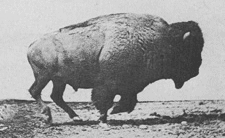

Link to ***[The Book](../index.html)***

## 1. Overview

- [Slides](01_Overview/Overview.html)

## 2. Processing Movement Data

- [Lecture Slides](02_ProcessingData/PreliminaryProcessing.html)

- [Lab](02_ProcessingData/Lab1_DataProcessing.html) ([code](02_ProcessingData/Lab1_DataProcessing.R))
  - data here: [Elk_GPS_data.csv](data/Elk_GPS_data.csv) (right-click to download). 

